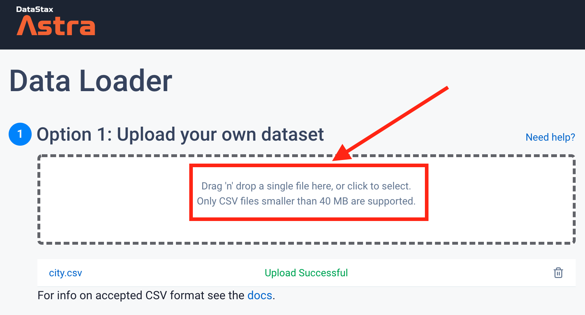
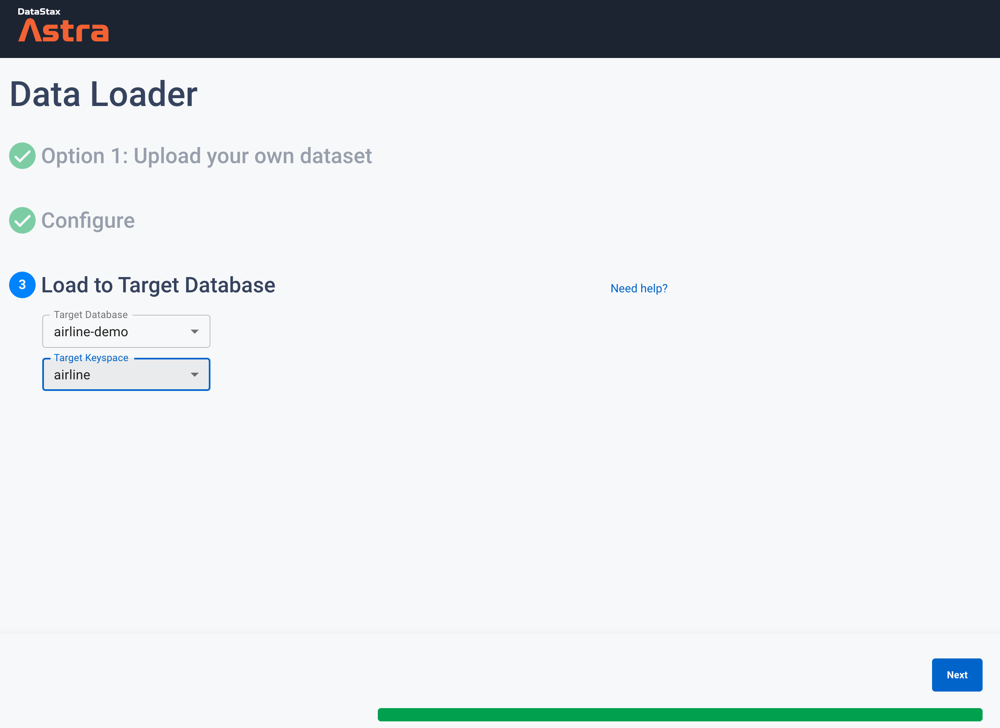

# Airline Demo User's Guide

This guide will walk you though the process of setting up your database and how to run the demo.

## Preparing Your Database

All you need is an Astra account. Create a database with any name you like (suggestion: airline-demo) and
in that database create a keyspac called ```airline```.

Now using the Astra web UI, access the CQL Shell tab and then copy the contents of the ```database/create.cql```
file and paste it into the CQL Shell. This will create the tables you will need.

Once you are in the CQL Shell for the ```airline``` keyspace, you will need to load some data. We use this approach because its much faster than sending millions of insert statements (that's alot of copying and pasting)!

### Execute the create.cql file

Open the contents of the ```database/create.cql``` file and copy and paste it into the CQL Shell window for your database (still in the Astra web UI).

### Data Loading with the Astra UI

You will load 2 of the tables into your database using the Load Data function built into the Astra web UI.

Use the Load Data button to start creating the ```city``` table with data.


Drag and drop the ```city.csv``` file from the ```database/``` folder of the github project onto the target area. You will see a small "success" message when thedata is loaded. Press the **Next** button.


In the **Configuration** step, it will show you a sample of the data. Scroll down to the bottom of the page where you can specify the partition key.=


Now you need to specify the ```name``` field as the partition key. **This is very important!**. Once that is done, press the **Next** button.


In the last step of the wizard, select the database that you created for this demo and then select the ```airline``` keyspace.


You will need to repeat these steps for the ```flight_by_id.csv``` file. When you import its data, be sure to specify the ```id``` field as its partition key.

You will also load the ```flight_by_id.csv``` a second time! This time set the
tablename to **flight_by_city** and set the fields **origin_city** AND
**destination_city** as the partition keys **in that order**. Also add the **id** field as the
clustering key.

### Using the Bulk Loader for Tickets and Baggage

The tickets.csv and baggage.csv files are too large to use the Load Data function in the Astra web UI. To do this you will first need to install the [DS Bulk Loader](https://docs.datastax.com/en/astra/docs/loading-and-unloading-data-with-datastax-bulk-loader.html) tool. Configure the tool to connect using your client_id and client_secret.

**Pro-Tip** Add the dsbulk's bin/ directory to your path so you can run it from anywhere.

Assuming that DSBulk is in your path, change to the ```database/``` directory run the following command to load the ticket.csv file:

```sh
dsbulk load -url export.csv -k airline -t ticket -b "path/to/secure-connect-database_name.zip" -u client_id -p client_secret -header true
```

Obviously, you will need to modify the path to your **secure-connect** ZIP file, **client_id** and **client_secret** with the correct values for your database. I find it easier to export the client id and client secret as environent variables using a command like:

```sh
export ASTRA_CLIENT_ID="THIS_IS_YOUR_CLIENT_ID"
export ASTRA_CLIENT_SECRET="THIS_IS_YOUR_CLIENT_SECRET"
```

It is important to enclose them in the quotations. On my machine I use the following command:

```sh
dsbulk load -url ticket.csv -k airline -t ticket -b "../python/secure-connect-airline-demo.zip" -u $ASTRA_CLIENT_ID -p $ASTRA_CLIENT_SECRET -header true
```

It  will take approximately 25 minutes to load the ```ticket``` table. It's loading over 4 million ticket records!

And finally, you will need to use the bulk loader for the ```baggage.csv``` file.

```sh
dsbulk load -url baggage.csv -k airline -t baggage -b "../python/secure-connect-airline-demo.zip" -u $ASTRA_CLIENT_ID -p $ASTRA_CLIENT_SECRET -header true
```

This will also take 7 - 10 minutes to execute. Its loading approximately 4 million baggage records.

## Running the Client

Run the flutter app from the code editor or directly on the simulator if you've already loaded it onto a device.

## Demo Steps

Just start at the top of the client and login, buy a ticket, etc. Just start at the top and work your way  down.

## Internationalization

The demo data is very US specific (ie US cities and states). If you want to alter the data to atch your customer's geography then you need to go to the ```python/generate.py``` file and modify the list of cities. See the ReadMe.md file in the ```python/``` directory for details on how to generate the csv files.
